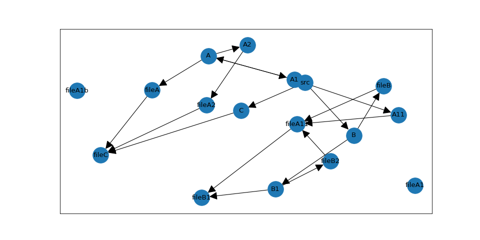

# General Concept
PyTestArch creates an Abstract Syntax Tree for each Python file it scans. It then extracts only the information about 
module imports from the AST and converts them to an internal representation. This is currently a graph supplied by the 
[NetworkX](https://networkx.org/) library.

When the user defines a rule and evaluates the internal representation against it, the rule is converted into a set of
graph operations that are then carried out on the previously generated graph.

## Generating the evaluable architecture representation
When scanning and processing the requested modules, PyTestArch executes the following step:
1) Parse all files starting at the requested `module_path`. This only takes python source files into account that are not explicitly excluded.

2) Convert the generated AST into custom dependency representations. In this step, it is ensured that all internal modules (either importing or imported) receive their fully 
qualified name.

3) Generate a list of all modules that were parsed. This list is used to differentiate between external and internal dependencies (external dependencies will not have been parsed).

4) If not requested otherwise, external dependencies will be filtered out.

5) If external dependencies should be included, they will be added to the list of modules.

6) The dependency representations are converted to a graph structure.


## Simple Example

### Parsing all files
Consider the following project structure:
```
my_project/
    src/
        main.py
        util.py
        util_test.py
```

Both `main.py` and `util_test.py` are importing a util function defined in `util.py`; no other imports exist.

With "my_project" as the project's root folder and "src" as the folder to evaluate, this will create the following graph:


Each module has a direct path to all submodules, in this case: "src" is connected to all three modules it contains, 
"src.main", "src.util", and "src.util_test".

In addition, a module that imports another module has a directed edge linking it to this module. For example, "src.main"
imports "src.util" and therefore the graph has an edge connecting these modules, with the arrow head pointing at the imported
module, in this case "src.util".

### Excluding some files

In the example above, the `util_test.py` file is included in the graph and will be considered when evaluating the architecture.
If certain files should be excluded from the analysis, this can be done by specifying an exclusion pattern. In our example,
if we want to exclude `util_test.py`, we could use:
```
from pytestarch.pytestarch import get_evaluable_architecture

evaluable = get_evaluable_architecture("/home/my_project", "/home/my_project/src", regex_exclusions=(".*_test\.py"))
```
This will exclude all files with names ending in "_test.py". It is also possible to exclude directories.


## More complex example
As a basis for describing the query language, let's consider a more complex example:
```
/test_project
    /src
       __init__.py
       /A
            __init__.py
            fileA.py
            /A1
                __init__.py
                fileA1.py
                fileA1_b.py
                /A11
                    __init__.py
                    fileA11.py
            /A2
                __init__.py
                fileA2.py
       /B
            __init__.py
            fileB.py
            /B1
                __init__.py
                fileB1.py
                fileB2.py
       /C 
            __init__.py
            fileC.py
```

With the following list of imports:
<ul>
    <li>fileA imports fileC</li>
    <li>fileA11 imports fileB1</li>
    <li>fileA2 imports fileC</li>
    <li>fileB imports fileA11</li>
    <li>fileB2 imports fileA11</li>
    <li>fileC imports the built-in os module</li>
</ul>

This creates the following graph (excluding all `__init__.py`):



Note that the module names in the diagram have been abbreviated: For example, the node "fileA" is actually named "src.A.fileA".

Most of the edges in this graph are due to parent-child relationships between the modules. However, five of the six import
relationships defined above are present in the graph - only fileC has no connection to an "os" node; in fact, there is no
node names "os" at all.

This has been achieved by setting the `exclude_external_libraries` flag in the `get_evaluable_architecture` function. All modules that 
not located hierarchically below the root path, in this case "test_project", will be excluded from the graph.


<br>
# Additional Notes
## root_path vs. module_path in get_evaluable_architecture
The `root_path` should point towards the most top level module. In the example above, this would be `src` - not `test_project`,
as `test_project` is not the top level code directory.
The `module_path` is the module where the dependency scan will start. It has to be either identical to `root_path` or 
a submodule of it.


## Module names
In all rules, modules have to be referred to by their fully qualified name, meaning relative to the `root_path` - not the
`module_path`! This helps to distinguish between internal and external modules.